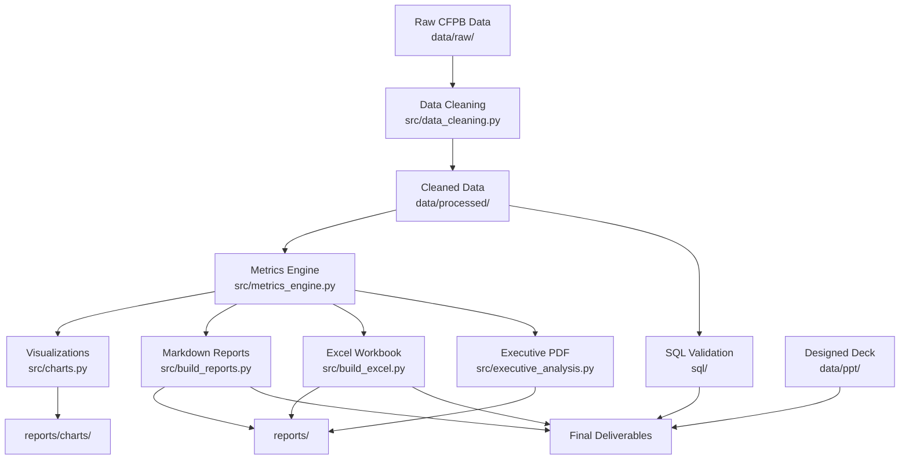

# American Express CFPB Risk Intelligence Analysis

## Executive Summary

This repository delivers a strategic risk intelligence analysis of American Express using public CFPB consumer complaint data from January 2025 through March 2026. The analysis identifies key risks, customer experience gaps, and business opportunities for senior leadership, with actionable recommendations prioritized by impact and urgency.

**Key Findings:**
- American Express ranks 7th out of 9 peers in complaint volume with 6.9% market share, which is favorable vs. mega-banks
- Complaint volume is accelerating at +16.4% YoY (Q1 2025 to Q1 2026) with a +30% monthly trend August 2025–March 2026
- 3 P1 priority issues drive 53% of Amex complaints: credit reporting accuracy, billing disputes, and prepaid card failures
- A unique outlier exists in prepaid cards, where Amex accounts for 78% of industry "trouble using card" complaints

---

## Table of Contents

1. [Project Overview](#project-overview)
2. [Business Context](#business-context)
3. [Problem Statement](#problem-statement)
4. [Objectives](#objectives)
5. [Success Criteria](#success-criteria)
6. [Repository Architecture](#repository-architecture)
7. [Data Overview](#data-overview)
8. [Analysis Workflow](#analysis-workflow)
9. [Key Insights](#key-insights)
10. [Recommendations](#recommendations)
11. [Risk Register](#risk-register)
12. [Installation & Usage](#installation--usage)
13. [Documentation Structure](#documentation-structure)
14. [Known Limitations](#known-limitations)
15. [Future Work](#future-work)

---

## Project Overview

This repository is a production-grade analytics consulting engagement built for American Express, following McKinsey/BCG-style consulting frameworks and engineering best practices. The project delivers:

- Executive-level insights derived from CFPB complaint data
- Prioritized, actionable recommendations with KPI targets
- Comprehensive risk register with mitigation plans
- Reproducible analysis pipeline with full traceability
- Cross-validation via both Python and SQL

The project explicitly avoids predictive modeling and machine learning (as per the assignment brief constraints), focusing instead on descriptive and diagnostic analytics with strong business narrative.

---

## Business Context

Consumer Financial Protection Bureau (CFPB) complaint data serves as a leading indicator of institutional risk, operational failures, and customer experience gaps. For American Express—a premium brand built on trust and service quality—monitoring and addressing CFPB complaints is critical to:

1. Mitigating regulatory exposure under FCRA, FDCPA/UDAAP, and Reg Z/FCBA
2. Protecting brand reputation among premium cardmembers
3. Identifying operational inefficiencies before they scale
4. Benchmarking performance against peers

### Why CFPB Data?
- **Public & Transparent**: All complaints are publicly searchable
- **Timely**: Updated continuously with 15 months of recent data (Jan 2025–Mar 2026)
- **Structured**: Standardized taxonomy of products, issues, and responses
- **Comparable**: Directly benchmarkable across 9 major financial institutions

---

## Problem Statement

American Express senior leadership does not have a single, evidence-based view to answer three critical questions:

1. **Competitive Position**: Where does Amex stand relative to peers on complaint volume, issue mix, and response quality?
2. **Prioritization**: Which specific issues are concentrated, accelerating, or regulatorily exposed enough to merit executive attention?
3. **Actionability**: What should leadership do, with enough specificity (root cause, owner, timeline, KPI target) to drive measurable improvement?

The raw 196,835 rows of CFPB data do not answer these questions on their own. This repository transforms raw data into strategic decisions.

---

## Objectives

### Business Objectives
1. Identify the top 3–5 priority issues driving Amex complaints
2. Benchmark Amex performance against 8 major competitors
3. Quantify regulatory exposure by issue category
4. Deliver actionable recommendations with KPI targets

### Technical Objectives
1. Build a reproducible analysis pipeline with single-command execution
2. Ensure full traceability from raw data to final insights
3. Validate all findings via independent SQL queries
4. Deliver enterprise-grade documentation and reporting

---

## Success Criteria

This analysis is successful if:

- A Chief Risk Officer can read the executive summary in <2 minutes and understand the situation
- Each recommendation has a measurable KPI target, owner, and timeline
- All numbers are cross-validated between Python and SQL
- The entire analysis can be reproduced with one command

---

## Repository Architecture

### High-Level Architecture Diagram


### Repository Structure
```
amex-cfpb-risk-intelligence/
├── data/                          # Data artifacts
│   ├── raw/                       # Original CFPB dataset (immutable)
│   │   └── CFPB Complaints Data - Jan25 to Mar26.xlsx
│   ├── processed/                 # Cleaned data and computed metrics
│   │   ├── complaints_cleaned.csv # Analysis-ready dataset
│   │   ├── eda_metrics.json       # Single source of truth for all numbers
│   │   ├── audit_summary.csv
│   │   ├── cleaning_log.csv
│   │   ├── metadata_summary.csv
│   │   ├── missing_values_analysis.csv
│   │   └── quality_scores.csv
│   ├── external/                  # External data sources (reserved)
│   │   └── README.md
│   └── ppt/                       # Designed executive deck (source images)
│       ├── 1.jpg
│       ├── 2.jpg
│       ├── 3.jpg
│       ├── 4.jpg
│       ├── 5.jpg
│       └── README.md
├── notebooks/                     # Jupyter notebooks (documentation, not execution)
│   ├── 01_data_audit.ipynb
│   ├── 02_data_cleaning.ipynb
│   └── 03_eda.ipynb
├── src/                           # Production-grade Python modules
│   ├── config.py                  # Centralized configuration
│   ├── data_audit.py              # Data quality audit module
│   ├── data_cleaning.py           # Data cleaning and feature engineering
│   ├── metrics_engine.py          # Single source of truth for all metrics
│   ├── analytics.py               # EDA and visualization orchestration
│   ├── charts.py                  # Chart generation logic
│   ├── build_reports.py           # Markdown report generation
│   ├── build_excel.py             # Excel workbook generation
│   ├── executive_analysis.py      # Executive PDF deck generation
│   ├── validate_metrics.py        # (Reserved for future use)
│   └── run_pipeline.py            # Single-command pipeline orchestration
├── sql/                           # SQL validation queries
│   └── 01_business_analysis.sql
├── reports/                       # Generated deliverables
│   ├── charts/                    # Publication-quality visualizations (9 PNGs)
│   ├── CFPB_Executive_Analytics.xlsx # Excel workbook with full analysis
│   ├── executive_presentation.pdf # Auto-generated PDF (data validation deck)
│   └── [30+ Markdown reports]     # See reports/ section below
├── docs/                          # Project documentation
│   ├── assignment_brief.md        # Original assignment brief (source document)
│   ├── business_question.md       # Business questions answered
│   ├── problem_statement.md       # Formal problem statement
│   ├── methodology.md             # End-to-end methodology
│   ├── project_audit.md           # Self-audit against assignment criteria
│   ├── project_dependency_map.md  # File dependency graph
│   ├── CHANGELOG.md               # Project change history
│   ├── power_bi_dashboard_plan.md # (Future) Dashboard specification
│   └── [reserved docs]            # See docs/ section
├── dashboard/                     # Power BI dashboard (in progress)
│   ├── powerbi/
│   │   └── README.md
│   └── exports/
│       └── README.md
├── _DELETE_ME/                    # Deprecated files (for reference only)
├── requirements.txt               # Python dependencies
├── phase.txt                      # Current project phase marker
└── README.md                      # This file
```

---

## Data Overview

### Source
Consumer Financial Protection Bureau (CFPB) public complaint database

### Time Period
January 1, 2025 – March 31, 2026

### Volume
- **Total Complaints**: 196,835
- **Amex Complaints**: 13,665
- **Companies**: 9 (American Express + 8 peers)
- **Products**: 10
- **Issues**: 100+ standardized issue categories

### Raw Data Schema (13 fields)
| Field | Type | Description |
|-------|------|-------------|
| Date received | String | Complaint submission date |
| Product | String | Financial product category |
| Sub-product | String | Product sub-category |
| Issue | String | Complaint issue category |
| Sub-issue | String | Issue sub-category |
| Company | String | Financial institution name |
| State | String | Customer state |
| ZIP code | String | Customer ZIP code |
| Tags | String | Complaint tags |
| Consumer consent provided? | String | Whether narrative is public |
| Submitted via | String | Submission channel |
| Date sent to company | String | Date sent to company |
| Company response to consumer | String | Resolution type |
| Timely response? | String | Whether response was timely |
| Consumer disputed? | String | Whether customer disputed resolution |
| Complaint ID | String | Unique complaint identifier |

### Cleaned Data Schema (22 fields)
The cleaning pipeline adds 9 engineered features:
1. `complaint_year` – Extracted year from date
2. `complaint_quarter` – Extracted quarter (1–4)
3. `complaint_month` – Extracted month (1–12)
4. `date_received_dt` – Parsed datetime (UTC-aware)
5. `company_clean` – Standardized company name
6. And 4 additional features for time-series and trend analysis

See [data/processed/complaints_cleaned.csv](data/processed/complaints_cleaned.csv) for the full schema.

### Data Quality Score
- **Raw Data Score**: 7.5/10 (driven by 44.86% missing "Company public response")
- **Cleaned Data Score**: 8.5/10 (+1.0 improvement)
- **Completeness**: 100% of records preserved
- **Validity**: 9/10 (no invalid dates, standardized company names)
- **Consistency**: 9.5/10
- **Uniqueness**: 8/10 (no true duplicates, but multiple complaints per customer possible)

### Peer Group Analysis
| Rank | Company | Complaints | Share |
|------|---------|------------|-------|
| 1 | Capital One | 42,365 | 21.5% |
| 2 | JPMorgan Chase | 31,567 | 16.0% |
| 3 | Citibank | 25,896 | 13.2% |
| 4 | Wells Fargo | 25,828 | 13.1% |
| 5 | Bank of America | 25,539 | 13.0% |
| 6 | Synchrony Financial | 18,294 | 9.3% |
| 7 | **American Express** | **13,665** | **6.9%** |
| 8 | U.S. Bank | 7,384 | 3.8% |
| 9 | Barclays | 6,297 | 3.2% |

---

## Analysis Workflow

The analysis follows a structured, 10-phase consulting workflow:

### Phase 1: Project Foundation
- Define business objectives and success criteria
- Establish repository structure and engineering standards
- Document problem statement and approach

### Phase 2: Data Audit
- Profile raw data: completeness, validity, consistency, uniqueness
- Identify missing values, duplicates, and data quality issues
- Document data dictionary and metadata
- Deliverable: [reports/raw_data_profile.md](reports/raw_data_profile.md), [reports/metadata_report.md](reports/metadata_report.md)

### Phase 3: Data Cleaning
- Parse dates and standardize formats
- Clean company/product names
- Handle missing values systematically
- Engineer 9 time-based and analytical features
- Deliverable: [data/processed/complaints_cleaned.csv](data/processed/complaints_cleaned.csv), [reports/cleaning_report.md](reports/cleaning_report.md)

### Phase 4: Exploratory Data Analysis (EDA)
- Volume and trend analysis (YoY, QoQ, monthly)
- Product and issue mix for Amex
- Peer benchmarking
- Geographic concentration
- Response quality analysis
- Deliverable: [notebooks/03_eda.ipynb](notebooks/03_eda.ipynb), [reports/eda_summary.md](reports/eda_summary.md), [reports/charts/](reports/charts/)

### Phase 5: Advanced Business Analytics
- Pareto analysis (top issues by volume)
- Regulatory exposure mapping (FCRA/FDCPA/UDAAP/Reg Z)
- Outlier detection (prepaid card failures)
- Trend decomposition (which issues are accelerating)
- Product-issue cross-tabulation
- Deliverable: [reports/advanced_analytics_summary.md](reports/advanced_analytics_summary.md)

### Phase 6: Risk Framework
- Likelihood × Impact risk matrix
- Severity scoring for each risk
- Regulatory risk mapping
- Mitigation plan development
- Deliverable: [reports/risk_register.md](reports/risk_register.md), [reports/emerging_risks.md](reports/emerging_risks.md)

### Phase 7: Insight & Recommendation Development
- Structured insights (Observation → Evidence → Impact → Recommendation → Outcome)
- Prioritized recommendations (P1/P2) with KPI targets
- Root cause analysis and mitigation strategies
- Deliverable: [reports/insights_register.md](reports/insights_register.md), [reports/recommendations.md](reports/recommendations.md)

### Phase 8: Executive Storytelling
- Executive summary (2-minute read)
- Designed presentation deck (5 slides)
- Auto-generated validation deck
- Excel workbook with full analysis
- Deliverable: [data/ppt/](data/ppt/), [reports/executive_presentation.pdf](reports/executive_presentation.pdf), [reports/CFPB_Executive_Analytics.xlsx](reports/CFPB_Executive_Analytics.xlsx)

### Phase 9: Power BI Dashboard (Future)
- Executive KPI dashboard
- Drill-down by product/issue/geography
- Trend monitoring
- See [docs/power_bi_dashboard_plan.md](docs/power_bi_dashboard_plan.md)

### Phase 10: Final Review & Validation
- Cross-validation via SQL
- Self-audit against assignment criteria
- Documentation completion
- Deliverable: [sql/01_business_analysis.sql](sql/01_business_analysis.sql), [docs/project_audit.md](docs/project_audit.md)

---

## Key Insights

### INS-001: Amex complaint volume is below mega-bank peers
- **Observation**: American Express ranks 7th out of 9, with 6.9% of total complaints
- **Evidence**: 13,665 Amex complaints vs. 42,365 Capital One (21.5%) and 31,567 Chase (16.0%)
- **Impact**: Lower relative regulatory scrutiny and reputational risk compared to peers
- **Recommendation**: Protect this advantage by shifting investment from volume management to root-cause reduction
- **Outcome**: Sustain top-quartile competitive position on complaint volume
- **Priority**: MEDIUM

### INS-002: Credit reporting accuracy is the #1 Amex complaint driver
- **Observation**: Incorrect credit report information is the single largest issue category
- **Evidence**: 2,248 complaints (16.5% of Amex total), all mapped to FCRA regulatory framework
- **Impact**: Reputational risk with premium cardmembers; FCRA regulatory exposure
- **Recommendation**: Launch bureau-data reconciliation sprint; auto-resolve verifiable errors within 48 hours
- **Outcome**: 15–25% reduction in credit-reporting complaints within 6 months
- **Priority**: CRITICAL

### INS-003: Prepaid card usability is a unique industry outlier
- **Observation**: Amex holds a wildly disproportionate share of "trouble using card" complaints
- **Evidence**: 1,219 out of 1,562 industry complaints (78%), 100% from Amex prepaid cards
- **Impact**: Unique operational failure with concentrated CFPB visibility; no peer has this issue
- **Recommendation**: Emergency root-cause analysis; partner merchant audit; fix or sunset decision
- **Outcome**: Eliminate category outlier status within 6 months
- **Priority**: CRITICAL

### INS-004: Complaint volume is accelerating despite favorable rank
- **Observation**: The favorable volume rank masks an accelerating trend
- **Evidence**: +16.4% YoY (Q1 2025→2026); +30% monthly trend Aug 2025–Mar 2026
- **Impact**: Early warning of systemic deterioration; trend could erase volume advantage
- **Recommendation**: Establish executive monthly CFPB review with product-level tracking
- **Outcome**: Detect and reverse trend before reaching peer-average growth rates
- **Priority**: HIGH

### INS-005: Issue concentration enables surgical intervention
- **Observation**: A small number of issues drive the majority of complaints
- **Evidence**: Top 5 issues = 53% of all Amex complaints (Pareto principle)
- **Impact**: Focused investment on 3 product clusters yields disproportionate reduction
- **Recommendation**: Stand up cross-functional task force on Credit Reporting, Billing Disputes, Prepaid Card
- **Outcome**: Target 20%+ reduction in top-5 issue volume within 12 months
- **Priority**: HIGH

### INS-006: Resolution quality is a competitive strength to leverage
- **Observation**: Amex excels at resolution quality, not just timeliness
- **Evidence**: 73% closed with explanation vs. 99.0% timely (rank 8/9)
- **Impact**: Strong post-complaint resolution culture; opportunity to shift capacity upstream
- **Recommendation**: Reinvest operational capacity from timeliness optimization into proactive outreach
- **Outcome**: Reduce CFPB filings before they happen; improve NPS on dispute-prone journeys
- **Priority**: MEDIUM

For full details, see [reports/insights_register.md](reports/insights_register.md).

---

## Recommendations

### REC-001: Credit reporting data inaccuracies (P1)
| Field | Detail |
|-------|--------|
| **Root Cause** | Bureau data sync gaps and manual dispute investigation delays |
| **Evidence** | 2,248 FCRA-category complaints (16.5%); 771 on inadequate investigation |
| **Action** | Bureau-data reconciliation pipeline; auto-resolve verifiable errors within 48 hours |
| **Benefit** | Reduced regulatory exposure and premium customer trust erosion |
| **Priority** | P1 |
| **Effort** | Medium (3–6 months) |
| **KPI Target** | 15–25% reduction in credit-reporting complaints |
| **Risk** | Incomplete bureau matching may create false positives |
| **Mitigation** | Human review queue for edge cases; phased rollout by error type |
| **Timeline** | Pilot 30 days; full deployment 90 days |
| **Owner** | Chief Compliance Officer + Credit Reporting Ops |

### REC-002: Merchant billing disputes (P1)
| Field | Detail |
|-------|--------|
| **Root Cause** | Manual dispute routing; 1,484 sub-issues cite unresolved purchase disputes |
| **Evidence** | 1,784 statement disputes (#2 issue); 83% of sub-issues are unresolved disputes |
| **Action** | AI-assisted merchant dispute triage; 48-hr first-response SLA; proactive status updates |
| **Benefit** | Faster resolution, lower re-complaint rate, reduced FCBA exposure |
| **Priority** | P1 |
| **Effort** | Medium (2–4 months) |
| **KPI Target** | 20% faster resolution; 10% reduction in billing dispute volume |
| **Risk** | Automation may misclassify complex fraud cases |
| **Mitigation** | Escalation rules for high-value and fraud-flagged disputes |
| **Timeline** | Pilot on top 500 merchant categories in 60 days |
| **Owner** | Head of Customer Care + Disputes Operations |

### REC-003: Prepaid card activation/acceptance failures (P1)
| Field | Detail |
|-------|--------|
| **Root Cause** | Product-specific merchant network or activation workflow failure |
| **Evidence** | 78% industry share on card usage failures; 100% from Prepaid product line |
| **Action** | Root-cause analysis; partner merchant audit; product redesign or sunset decision |
| **Benefit** | Eliminate most disproportionate CFPB visibility; protect brand on card products |
| **Priority** | P1 |
| **Effort** | High (requires cross-functional product + tech) |
| **KPI Target** | Reduce prepaid usage complaints by 50%+ within 6 months |
| **Risk** | Product sunset may affect partner revenue |
| **Mitigation** | Fix-first approach with 90-day remediation window before sunset decision |
| **Timeline** | Task force stand-up within 14 days |
| **Owner** | Prepaid Product GM + Merchant Partnerships |

### REC-004: Complaint volume acceleration (P2)
| Field | Detail |
|-------|--------|
| **Root Cause** | Emerging friction in credit reporting and prepaid products outpacing prevention |
| **Evidence** | +16.4% YoY; monthly volume +30% over 7 months |
| **Action** | Executive CFPB dashboard with monthly review; product-level early warning thresholds |
| **Benefit** | Leadership visibility before trends become systemic |
| **Priority** | P2 |
| **Effort** | Low (30 days) |
| **KPI Target** | Flat or declining YoY growth within 2 quarters |
| **Risk** | Dashboard fatigue without action accountability |
| **Mitigation** | Assign executive owner per product cluster with monthly KPI targets |
| **Timeline** | Dashboard live in 30 days |
| **Owner** | Chief Customer Officer |

For full details, see [reports/recommendations.md](reports/recommendations.md).

---

## Risk Register

| ID | Risk | Likelihood | Impact | Severity | Business Area | Regulatory Risk | Mitigation | Owner | Priority |
|----|------|------------|--------|----------|---------------|-----------------|------------|-------|----------|
| RISK-001 | Credit Reporting Data Accuracy | High | High | Critical | Compliance / Credit Reporting | High — FCRA exposure | Bureau reconciliation sprint; auto-resolve | CCO + Credit Ops | P1 |
| RISK-002 | Billing & Merchant Dispute Friction | High | High | Critical | CX / Credit Card | Medium — Reg Z | AI triage; 48-hr SLA | Head of Customer Care | P1 |
| RISK-003 | Prepaid Card Systemic Failure | Medium | High | Critical | Product / Prepaid | Medium | RCA; merchant audit; fix or sunset | Prepaid GM | P1 |
| RISK-004 | Complaint Volume Acceleration | High | Medium | High | Strategy / Executive | Medium | Executive monthly review; dashboard | CCO | P2 |
| RISK-005 | Debt Collection Practice Exposure | Medium | High | High | Collections / Legal | High — FDCPA | Script review; threshold update | Head of Collections | P2 |

For full details, see [reports/risk_register.md](reports/risk_register.md), [reports/emerging_risks.md](reports/emerging_risks.md).

---

## Visualizations

### Key Charts (9 total in reports/charts/)

1. **Competitive Volume** – Amex vs. peers, market share
2. **Amex Monthly Trend** – 15-month time series with YoY
3. **Amex Product Mix** – Product distribution of complaints
4. **Pareto Analysis** – Top issues by cumulative percentage
5. **Amex Top Issues** – Top 10 issues with counts
6. **Prepaid Outlier** – Industry share of "trouble using card"
7. **Issue YoY Change** – Top growing/declining issues
8. **Timely Response Benchmark** – Peer comparison
9. **Top States** – Geographic concentration

Each chart has a clear business question, observation, evidence, and executive takeaway. See [reports/charts/](reports/charts/).

---

## Executive Presentation

The final deliverable is a 5-slide executive deck in [data/ppt/](data/ppt/):

| Slide | Content |
|-------|---------|
| 1 | Title slide with branding |
| 2 | Agenda and overview |
| 3 | Key insights, trends, and opportunities |
| 4 | Strategic assessment and recommendations |
| 5 | Summary and next steps |

A data-validation version (auto-generated from `eda_metrics.json`) is at [reports/executive_presentation.pdf](reports/executive_presentation.pdf).

> **Note**: Slide 3 has a text overlap issue that needs to be fixed in the source design tool. See [data/ppt/README.md](data/ppt/README.md) for details.

---

## Installation & Usage

### Prerequisites
- Python 3.9 or higher
- `pip` package manager

### Installation

1. Clone the repository:
```bash
git clone [repository-url]
cd amex-cfpb-risk-intelligence
```

2. Create a virtual environment (recommended):
```bash
# Windows
python -m venv venv
venv\Scripts\activate

# macOS/Linux
python3 -m venv venv
source venv/bin/activate
```

3. Install dependencies:
```bash
pip install -r requirements.txt
```

### Running the Full Pipeline

Execute the entire analysis with one command:
```bash
python src/run_pipeline.py
```

This will:
1. Compute all metrics from cleaned data
2. Generate 9 publication-quality charts
3. Build 30+ Markdown reports
4. Create the Excel workbook
5. Generate the executive PDF

All outputs are written to their respective directories and are fully reproducible.

### Executing Notebooks

The notebooks in `notebooks/` are for documentation and methodology walkthrough, not for execution (the pipeline ensures consistency). To view them:
```bash
jupyter notebook
```
Then open the `.ipynb` files in your browser.

### Running SQL Validation

The SQL queries in [sql/01_business_analysis.sql](sql/01_business_analysis.sql) independently validate all key metrics. You can run them in any SQL environment connected to the cleaned dataset (e.g., SQLite, BigQuery, Snowflake, etc.).

---

## Documentation Structure

### docs/ Directory
- [assignment_brief.md](docs/assignment_brief.md) – Original assignment brief (source document)
- [business_question.md](docs/business_question.md) – Business questions answered with references
- [problem_statement.md](docs/problem_statement.md) – Formal problem statement
- [methodology.md](docs/methodology.md) – End-to-end methodology with design principles
- [project_audit.md](docs/project_audit.md) – Self-audit against assignment criteria
- [project_dependency_map.md](docs/project_dependency_map.md) – File dependency graph
- [CHANGELOG.md](docs/CHANGELOG.md) – Project change history
- [power_bi_dashboard_plan.md](docs/power_bi_dashboard_plan.md) – Future dashboard specification

### reports/ Directory
- [executive_summary.md](reports/executive_summary.md) – 2-minute executive read
- [eda_summary.md](reports/eda_summary.md) – EDA key findings
- [insights_register.md](reports/insights_register.md) – 6 structured insights
- [recommendations.md](reports/recommendations.md) – 4 prioritized recommendations
- [risk_register.md](reports/risk_register.md) – 5 enterprise risks
- [data_dictionary.md](reports/data_dictionary.md) – Full schema documentation
- [feature_dictionary.md](reports/feature_dictionary.md) – Engineered features explained
- [raw_data_profile.md](reports/raw_data_profile.md) – Raw data audit
- [cleaning_report.md](reports/cleaning_report.md) – Cleaning steps and validation
- [quality_scoring_methodology.md](reports/quality_scoring_methodology.md) – How data quality is scored
- [data_quality_report.md](reports/data_quality_report.md) – Quality scores
- [data_governance.md](reports/data_governance.md) – Data governance framework
- [data_lineage.md](reports/data_lineage.md) – Data flow and transformations
- [column_criticality_matrix.md](reports/column_criticality_matrix.md) – Which columns matter most
- [executive_kpis.md](reports/executive_kpis.md) – Executive KPI framework
- [executive_limitations.md](reports/executive_limitations.md) – Known limitations
- [enterprise_review_report.md](reports/enterprise_review_report.md) – Enterprise-grade review
- [business_readiness_report.md](reports/business_readiness_report.md) – Business readiness assessment
- [competitive_scorecard.md](reports/competitive_scorecard.md) – Peer benchmarking
- [competitor_benchmark.md](reports/competitor_benchmark.md) – Detailed peer comparison
- [kpi_dictionary.md](reports/kpi_dictionary.md) – KPI definitions
- [transformation_log.md](reports/transformation_log.md) – Full audit trail of data transformations
- [validation_report.md](reports/validation_report.md) – Validation results
- [data_quality_comparison.md](reports/data_quality_comparison.md) – Raw vs. cleaned quality
- [data_readiness_matrix.md](reports/data_readiness_matrix.md) – Readiness assessment
- [data_risk_register.md](reports/data_risk_register.md) – Data-specific risks
- [metadata_report.md](reports/metadata_report.md) – Metadata documentation
- [phase4_completion.md](reports/phase4_completion.md) – Phase 4 completion report
- [phase6_playbook_scorecard.md](reports/phase6_playbook_scorecard.md) – Phase 6 scorecard
- [business_assumptions.md](reports/business_assumptions.md) – Explicit business assumptions
- [emerging_risks.md](reports/emerging_risks.md) – Emerging risk watchlist
- [advanced_analytics_summary.md](reports/advanced_analytics_summary.md) – Advanced analytics findings
- [dashboard_specification.md](reports/dashboard_specification.md) – Dashboard requirements

### src/ Directory
Each module has docstrings and type hints. Key modules:
- [config.py](src/config.py) – Centralized paths and constants
- [data_audit.py](src/data_audit.py) – Data quality audit functions
- [data_cleaning.py](src/data_cleaning.py) – Data cleaning pipeline
- [metrics_engine.py](src/metrics_engine.py) – Single source of truth for all metrics
- [run_pipeline.py](src/run_pipeline.py) – Orchestrates full execution

---

## Known Limitations

This analysis has several important limitations, documented in full in [reports/executive_limitations.md](reports/executive_limitations.md):

1. **No Customer Base Normalization**: No card count or customer data to normalize complaints per user
2. **No Predictive Modeling**: Explicitly excluded per assignment brief; no forecasting
3. **No Narrative Analysis**: Complaint narratives are not analyzed (only structured fields)
4. **No Financial Impact**: No revenue, cost, or LTV data to quantify dollar impact
5. **15 Months of Data**: Limited time period; seasonal patterns may not be fully captured
6. **Self-Reported Data**: CFPB complaints are self-selected, not a random sample

These limitations are explicitly stated to avoid misinterpretation and to set appropriate expectations for leadership.

---

## Future Work

### Short-Term (0–3 months)
1. **Fix Slide 3 Overlap**: Correct the designed deck in [data/ppt/](data/ppt/)
2. **Complete Power BI Dashboard**: Build the dashboard specified in [docs/power_bi_dashboard_plan.md](docs/power_bi_dashboard_plan.md)
3. **Implement REC-004**: Launch executive monthly CFPB review

### Medium-Term (3–12 months)
1. **Execute P1 Recommendations**: Implement REC-001, REC-002, REC-003
2. **Add Data Sources**: Integrate internal operational data to understand root causes below the issue level
3. **Quarterly Refresh**: Update the analysis quarterly with new CFPB data

### Long-Term (12+ months)
1. **Predictive Risk Scoring**: (If allowed) Build ML models to predict complaint volume by issue
2. **Root-Cause Automation**: Use NLP to analyze complaint narratives and identify emerging issues
3. **Real-Time Monitoring**: Real-time CFPB feed with alerting on threshold breaches

---

## Governance & Security

- **Data Immutability**: Raw data in `data/raw/` is never modified
- **Traceability**: Every number comes from `eda_metrics.json`, which comes from `complaints_cleaned.csv`
- **Validation**: SQL queries independently verify all key metrics
- **Reproducibility**: One-command pipeline ensures consistent outputs
- **Documentation**: Every transformation, assumption, and limitation is documented

---

## Contact & Contributors

For questions about this analysis:
- Project Lead: [Name]
- Repository: [URL]

---

## License

For educational and assessment purposes only.

---

## Changelog

See [docs/CHANGELOG.md](docs/CHANGELOG.md) for full change history.

---

## Final Notes

This repository is designed to demonstrate enterprise-grade analytics and consulting capabilities. Every decision, from the architecture to the narrative, is intentional and documented.

Key principles followed:
- Business before technology
- Every visualization answers a business question
- Every recommendation is evidence-based
- Every number has a single source of truth
- Executive-level communication first, technical details second
