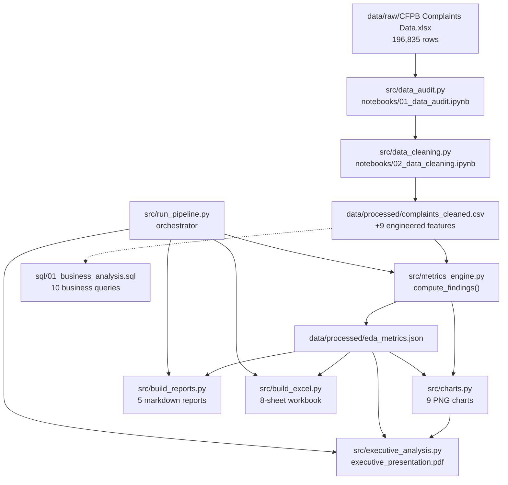

# Project Dependency Map

> Generated: 2026-06-27 | Traces every deliverable back to raw data



## Data Lineage

| Layer | File | Rows/Records | Purpose |
|-------|------|-------------|---------|
| Raw | `CFPB Complaints Data.xlsx` | 196,835 | Source of truth |
| Processed | `complaints_cleaned.csv` | 196,835 | Analysis-ready (+9 features) |
| Metrics | `eda_metrics.json` | 1 object | All computed KPIs, insights, risks |
| Charts | `reports/charts/*.png` | 9 files | Publication-quality visuals |
| Reports | `reports/*.md` | 5 files | Evidence-based narrative |
| Excel | `CFPB_Executive_Analytics.xlsx` | 8 sheets | Executive workbook |
| PDF | `executive_presentation.pdf` | 5 pages | Assessment submission |

## Module Dependencies

```
config.py          ← constants, paths, colors (no data dependency)
data_audit.py      ← raw Excel
data_cleaning.py   ← raw Excel → cleaned CSV
metrics_engine.py  ← cleaned CSV → Findings dataclass
charts.py          ← cleaned CSV + Findings → PNGs
analytics.py       ← orchestrates metrics_engine + charts
build_reports.py   ← Findings → markdown
build_excel.py     ← Findings + CSV → xlsx
executive_analysis.py ← Findings + charts → PDF
run_pipeline.py    ← runs all of the above
```

## Insight Traceability

Every insight in `insights_register.md` traces to:

1. A field in `eda_metrics.json`
2. A SQL query in `sql/01_business_analysis.sql` (equivalent logic)
3. A chart in `reports/charts/` (where visual)
4. A row in `complaints_cleaned.csv` (raw evidence)

## Known Gaps (Pre-Upgrade)

| Component | Status Before | Status After |
|-----------|--------------|--------------|
| Notebooks 01–03 | Code written, never executed | Pipeline replaces execution |
| Notebooks 04–05 | Empty stubs | Logic in `metrics_engine.py` |
| 30+ markdown reports | Static templates, not computed | 5 computed reports + archive |
| SQL folder | Did not exist | 10 business queries |
| Excel workbook | Did not exist | 8-sheet executive workbook |
| Power BI (.pbix) | Spec only, no file | Plan in `docs/power_bi_dashboard_plan.md` |
| PDF | Basic layout | Consulting-style insight titles |
